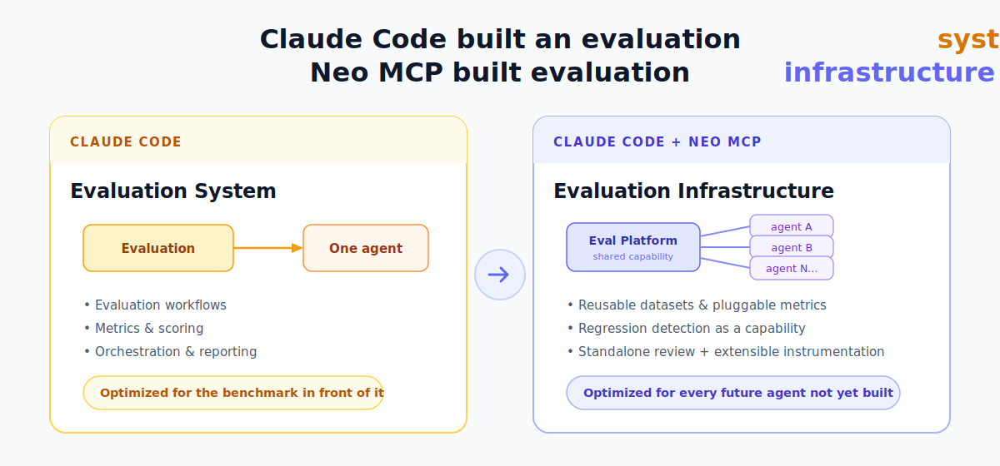
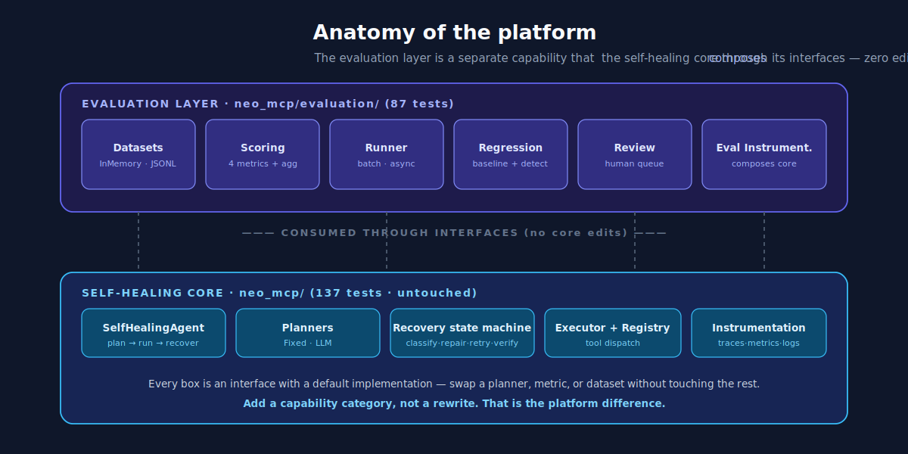

# Agent Evaluation Framework — A Neo MCP Benchmark



This repository is a **head-to-head benchmark**: the same production-grade brief — build a self-healing AI agent pipeline and, on top of it, an evaluation platform — solved twice.

- Once by **Claude Code alone** → [`claudecode/`](claudecode/)
- Once by **Claude Code + [Neo MCP](https://heyneo.so)** → [`neo-mcp/`](neo-mcp/)

The finding wasn't that one wrote more code. It was a difference in *altitude*: one built a **system** that solves the benchmark; the other built **infrastructure** designed for every future agent. The full story is in **[blog.md](blog.md)**.

> **TL;DR** — Both implementations work and are fully tested. The Neo MCP build consistently made decisions that assumed future growth: reusable datasets, pluggable metrics, regression detection as its own capability, standalone review workflows, and an evaluation layer that *composes* the self-healing core through its interfaces without editing a single core file.

---

## The two implementations at a glance

| | `claudecode/` — Claude Code | `neo-mcp/` — Claude Code + Neo MCP |
|---|---|---|
| **Package** | `selfheal` | `neo_mcp` |
| **Framing** | A self-healing pipeline | A self-healing **platform** + **evaluation layer** |
| **Tests** | 34 | 224 (137 core · 87 evaluation) |
| **Python** | 3.10+ | 3.12+ |
| **Runtime deps** | none (stdlib only) | `anthropic`, `python-dotenv` |
| **Evaluation layer** | — | datasets · scoring · runner · regression · review · instrumentation |
| **Docs** | [`claudecode/README.md`](claudecode/README.md) | [`neo-mcp/README.md`](neo-mcp/README.md), [`neo-mcp/docs/EVALUATION.md`](neo-mcp/docs/EVALUATION.md) |

Both share the same recovery philosophy — *self-healing is not "retry until it works"*:

> classify the failure → decide if it's transient → repair the call if possible → retry → verify the output → record the incident → escalate only if required.

The difference is what surrounds that loop.

---

## What platform thinking looked like in the code

The Neo MCP build added a full evaluation capability as a **separate layer that composes the self-healing core through its interfaces** — zero edits to the core (verified by the original 137 core tests remaining green).



The litmus test for platform thinking: *can you add a new capability category without a rewrite?* Here you can — a new metric implements one interface, a new dataset source implements another, and eval-specific observability composes the existing instrumentation rather than forking it.

---

## Repository layout

```
AgentEvaluationFramework/
├── blog.md                     # The benchmark write-up (with infographics)
├── assets/                     # SVG infographics used by blog.md and this README
├── claudecode/                 # Implementation A — Claude Code alone
│   ├── selfheal/               #   self-healing pipeline package
│   ├── examples/demo.py        #   runnable end-to-end demo
│   └── tests/                  #   34 tests
└── neo-mcp/                    # Implementation B — Claude Code + Neo MCP
    ├── neo_mcp/
    │   ├── core/ recovery/ planners/ executor/ agent/ observability/   # self-healing core
    │   ├── evaluation/         #   the evaluation layer (datasets, scoring, runner,
    │   │                       #   regression, review, eval instrumentation, demo)
    │   ├── demos/              #   self-healing E2E demo
    │   └── tests/              #   224 tests (incl. tests/evaluation/)
    └── docs/EVALUATION.md      #   evaluation-layer architecture & extension guide
```

---

## Run it

### A — Claude Code (`selfheal`)

No dependencies beyond the standard library; `pytest` only for tests.

```bash
cd claudecode
python -m examples.demo     # self-healing demo: transient retry, arg repair, backoff
python -m pytest            # 34 tests
```

### B — Claude Code + Neo MCP (`neo_mcp`)

```bash
cd neo-mcp
python3 -m venv venv && source venv/bin/activate
pip install anthropic python-dotenv pytest

# Self-healing platform demo (LLM-backed pieces use ANTHROPIC_API_KEY if set;
# the demo runs deterministically with FixedPlanner + fake providers otherwise)
python -m neo_mcp.demos.demo_runner

# Evaluation layer end-to-end demo:
#   dataset → batch run → scoring → aggregation → baseline → regression → review queue
python -m neo_mcp.evaluation.eval_demo

python -m pytest            # 224 tests
```

> The evaluation demo and tests use fakes/mocks — **no real LLM calls required**. An `ANTHROPIC_API_KEY` is only needed if you exercise the LLM-backed planner/argument-repairer in the self-healing core.

---

## Read next

- **[blog.md](blog.md)** — the full benchmark narrative and what it implies for teams scaling from agents to AI platforms.
- **[neo-mcp/docs/EVALUATION.md](neo-mcp/docs/EVALUATION.md)** — how the evaluation layer consumes the core and how to extend it with new metrics, datasets, and regression detectors.

---

<sub>Infographics in <code>assets/</code> are hand-authored SVGs and render directly on GitHub. The two implementations were produced as part of a benchmark of Neo MCP's effect on how Claude Code approaches production AI engineering.</sub>
