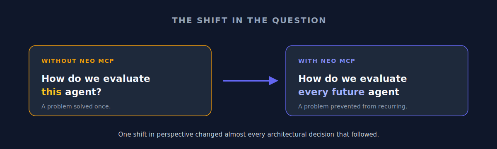
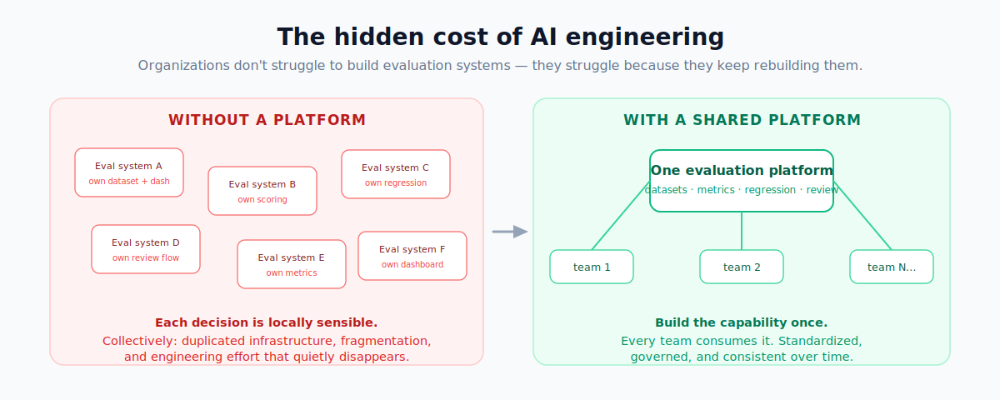
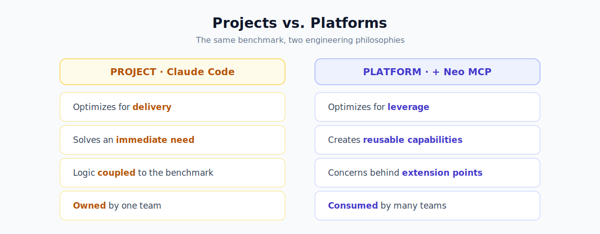

# Claude Code Built an Evaluation System. Neo MCP Built Evaluation Infrastructure.

We sat down to benchmark an AI coding agent and ended up arguing about platform engineering. That wasn't on the agenda.

The brief was deliberately ordinary. We asked Claude Code to build a production-grade evaluation platform for AI agents — datasets, scoring, regression detection, human review workflows, observability, safety checks, latency tracking, reporting. The kind of spec that lands in an engineering channel on a Tuesday and gets quietly shipped by Friday. On paper, it was just another evaluation-engineering exercise.

Then we ran the same brief a second time with Neo MCP enabled, and the whole conversation moved up a floor. We stopped talking about evaluation *features* and started talking about evaluation *infrastructure*. Same prompt, same model, a very different discussion — and that gap is what this post is about.

---

## What we expected to see

Going in, our mental model was simple: Neo MCP would help Claude Code build a *better* evaluation system. Cleaner architecture, maybe. A more complete implementation. More code, more abstractions, more automation — the usual ways AI tooling makes itself felt.

What actually changed had almost nothing to do with volume. The difference wasn't in *what* Claude built. It was in *how it approached the problem in the first place.*

---

## The first solution solved the benchmark

The Claude Code implementation was the one most experienced engineers would recognize, because it's the one most of us would write. It had evaluation workflows, metrics, orchestration, and reporting. Point it at an agent and it evaluated the agent. It did the job.

And there was nothing wrong with that. This is how a huge share of production software is born: a team has a problem, builds a solution, the solution works, the project ships, and the story ends — at least until the next project needs the same thing and quietly starts over.

---

## Then Neo MCP changed the direction

The second implementation felt different almost from the first decision, and not for the reasons you might guess. It wasn't dramatically larger. It didn't unlock some capability the first one couldn't reach. It hadn't suddenly gotten smarter.

What changed was that Claude started making choices that assumed the future would arrive. Instead of welding the evaluation logic to this one benchmark, it reached for reusable concepts. Datasets turned into services you could point at anything. Metrics became pluggable components. Regression detection became a capability in its own right rather than a script. Review workflows became standalone systems. Instrumentation became something you could extend instead of replace.

The implementation had quietly stopped optimizing for the benchmark in front of it and started optimizing for whatever came *after* the benchmark. That's where the real lesson surfaced.

---

## We thought we were looking at evaluation

What we were actually looking at was platform thinking.

Most evaluation systems answer one question: *how do we evaluate this agent?* The Neo MCP–assisted build was clearly answering a harder one: *how do we evaluate every future agent we haven't built yet?*

That single change in framing rippled through nearly every architectural decision that followed. The moment you're solving for future agents instead of the current one, a different set of priorities takes over — reusability, standardization, extension points, governance, shared infrastructure. The goal is no longer to solve the problem once. It's to stop the same problem from being solved over and over again.

---

## The hidden cost of AI engineering

Here's the thing most teams discover too late: organizations rarely struggle to *build* evaluation systems. They struggle because they keep *rebuilding* them.

A new project spins up. Someone writes another evaluation dataset. Another scoring framework. Another regression workflow, another dashboard, another review process. Every one of those calls is locally reasonable. Collectively, they're how an organization ends up with a dozen subtly different evaluation systems all solving the same problem in slightly incompatible ways.

That's where engineering effort quietly evaporates — not into models, prompts, or agents, but into duplicated infrastructure nobody chose to build on purpose. And that duplication is exactly the pattern Neo MCP seemed to steer Claude away from.

---

## The most interesting thing Neo MCP changed wasn't the code

It was the mindset. Without Neo MCP, Claude behaved like an engineer building a project. With it, Claude behaved like an engineer building a platform.

That sounds like a philosophical distinction. It isn't.

Projects optimize for delivery; platforms optimize for leverage. Projects solve an immediate need; platforms create reusable capabilities. Projects are owned by a team; platforms are consumed by many. Look at the benchmark through that lens and the second implementation stops looking over-engineered and starts looking deliberate. The abstractions aren't there because abstractions are virtuous — they're there because platform engineers reason differently about future complexity.

---

## What platform thinking looked like in the code

This wasn't only a difference in attitude. It left a concrete artifact.

The evaluation capability was built as a *separate layer that composes the self-healing core through its interfaces* — without editing a single core file, a constraint we could verify because the core's original test suite stayed green throughout. Datasets, scoring, batch execution, regression detection, human review, and instrumentation each became an independently swappable part.

The litmus test for platform thinking is blunt: *can you add a new capability category without a rewrite?* Here you can. A new metric implements one interface. A new dataset source implements another. The evaluation-specific observability *composes* the existing instrumentation instead of forking it. That is what "optimized for the next agent" looks like once it reaches the file system rather than the slide deck.

---

## Why this matters

The industry is moving past single-agent experiments fast. Teams are running multiple agents, multiple workflows, multiple environments, across multiple teams. As that happens, evaluation stops being an application concern and becomes an infrastructure concern.

The question shifts from *can we evaluate an agent?* to *can we evaluate dozens of agents consistently, over time, without rebuilding the machinery each time?* That second question is genuinely harder, and it rewards a different way of thinking. The striking part of this benchmark wasn't that Neo MCP added evaluation features — it's that it kept nudging Claude Code toward architectures built for that future.

---

## The real benchmark result

We went in thinking we were comparing two implementations. Looking back, we were comparing two engineering philosophies.

One treats evaluation as functionality bolted onto an agent. The other treats it as infrastructure that can carry many agents. Both are legitimate. Both ship working systems. But only one keeps paying off as an organization moves from *building agents* to *operating an AI platform.*

So the most valuable thing Neo MCP contributed wasn't a feature, an integration, or even a specific pattern. It was a different read on the problem itself.

---

## Final thoughts

Most AI teams believe they have an agent problem. A surprising number actually have a platform problem — and evaluation is usually where it shows up first.

We started this benchmark expecting to learn something about evaluation systems. We came away having learned something about AI engineering: the most consequential thing Neo MCP changed wasn't the code Claude produced, but the way Claude decided what was worth building. As these systems keep scaling, that may turn out to be the difference that matters most.

---

*Both implementations discussed here live in this repository: [`claudecode/`](claudecode/) (Claude Code alone) and [`neo-mcp/`](neo-mcp/) (Claude Code + Neo MCP). See the [repository README](README.md) for how to run and compare them.*
